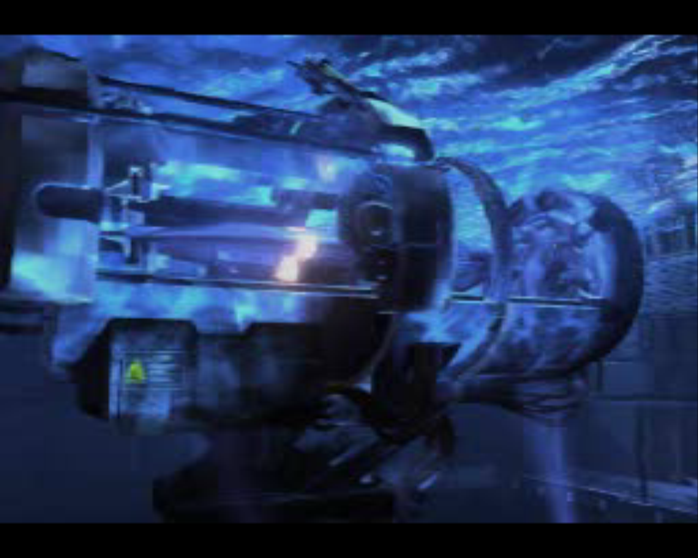
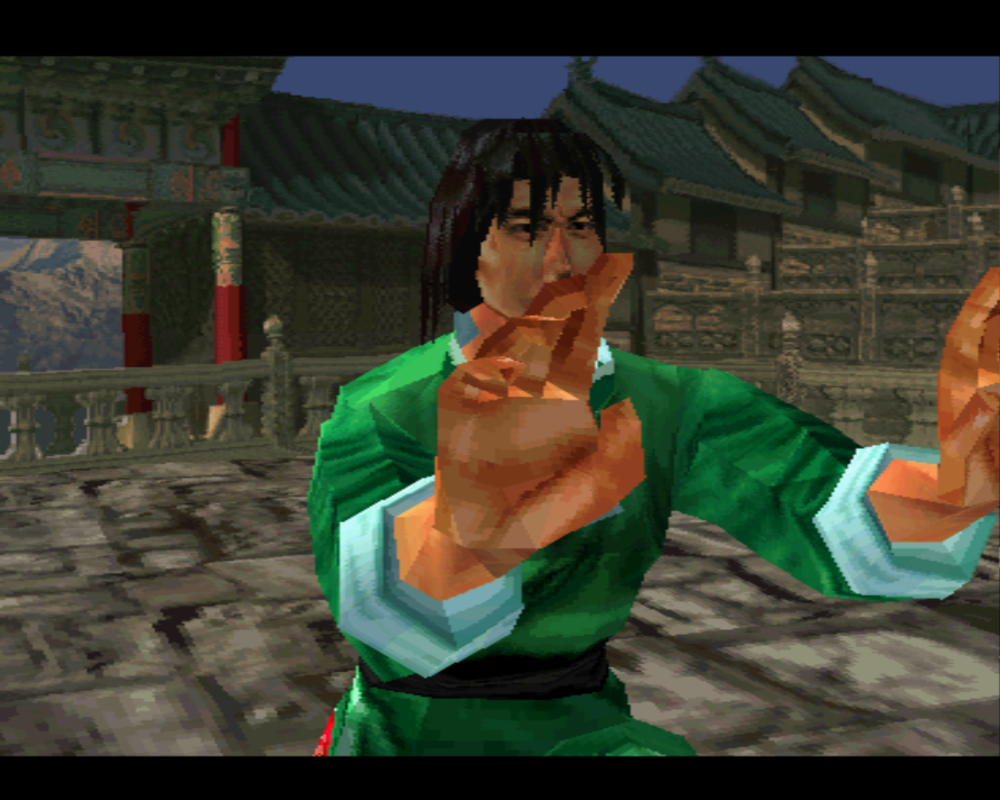

# Tekken 3 (SLUS-00402) — bring-up findings

Status: **boots, plays the intro FMV, and renders the real-time-3D attract
demo.** The first-boot crash is fixed by the text-divergence guard (below).
Not yet verified: menu input, an actual fight, audio.




## Setup

- Disc: multi-track (`Track 1` MODE2/2352 data + `Track 2/3` CDDA redbook audio).
- Boot EXE `\TEKKEN3\SLUS_004.02` (LBA 25), extracted and verified.
  - PS-X EXE header: `initial_pc=0x80079C70`, `load_address=0x80010000`,
    `text_size=0x121000`, `stack_base=0x801FFFF0`.
- `games/tekken3/game.toml`, `seeds.txt`, and a `tekken3-runtime` CMake target.

## Recompile pass — GREEN

`psxrecomp-game --config games/tekken3/game.toml`:

- **0 unsupported/unknown instructions** — the recompiler fully covers every
  MIPS opcode Tekken 3 uses. No codegen work needed.
- Discovery from `entry_pc` alone (no seeds): 2403 real functions →
  19741 emit entries. 224 out-of-function boundary warnings (clustered in the
  packed region below). 574k lines of C emitted; `tekken3-runtime` builds and
  boots the BIOS.

## First-boot crash — root cause localized

Boots BIOS, runs ~24 s, then the outer trampoline sees `PC=0` (null-jump exit).
`psx_cps_exit_trace.json` chain (fntrace, `PSX_FNTRACE_ALL=1`):

```
target=0x800DB12C ra=0x8004FDD4 sp=0x801FFFB0   (healthy stack)
target=0x800DB16C ra=0x8004FDD4 sp=0x801FFFB0
target=0x8FF80044 ra=0x800DB174 sp=0x001102E2   (wild jump, sp corrupt) -> PC=0
```

Disassembly of the target region shows it is **not code**:

```
0x800DB16C: 0FFE0011  jal   0x8ff80044        <- the wild jump
0x800DB170: 203D02E2  addi  $sp, $at, 0x2e2   <- the corrupt sp (0x..2E2)
```

Most words in 0x800DB1xx are undecodable/high-entropy. The caller, in clean
code, makes a hardcoded direct call into it:

```
0x8004FDCC: 0C036C4B  jal 0x800db12c
```

## Diagnosis: a large runtime-installed (packed/overlay) code region

A decodability map of the EXE shows alternating code and packed sections, with
one **large packed region 0x800B8000–0x80128000 (~448 KB)** that contains
0x800DB12C. Key facts:

- The disc rip is byte-verified (all 579 EXE sectors contiguous Mode2 Form1,
  correct sync + BCD addresses) — the "garbage" is genuinely in the EXE image.
- Clean, uncompressed early code issues a **hardcoded** `jal 0x800db12c`.
- Tekken 3 obviously runs on real hardware.

Therefore this region must be **populated at runtime** (decompressed or
disc-loaded) before the call — i.e. install-at-runtime / self-modifying code
(CLAUDE.md §18; the README's "genuinely self-modifying / per-load-relocated
code" frontier). The static recompiler treated the packed *source* bytes as
functions (hence the boundary warnings), and at the `jal` our dispatch ran the
bogus static version instead of routing to the dirty-RAM interpreter / capture
path. Result: it executes packed data as instructions → corrupt `$sp` + wild
jump → `PC=0`.

Not yet directly observed: the runtime write that installs real code into
0x800B8000+. Confirming that write (and why dispatch to the now-dirty page did
not route to the interpreter) is the next step.

## Reassessment

Tekken 3's *code* is fully recompilable (0 unsupported instructions), but it is
**not the clean fully-static game first assumed** — it installs a ~448 KB code
region at runtime and calls into it. That is the overlay/dirty-RAM frontier
(harder than Kula World, which only hit small libcd RAM stubs). Tractable with
the framework's existing capture→compile→cache + dirty-RAM machinery, but a
real multi-round investigation, not a quick win.

## The fix — text-divergence guard (framework-level)

Investigation of the routing showed the dirty bitmap was NOT the hole: the
BIOS loads the whole EXE via CD-DMA, so every text page was already dirty and
psx_dispatch_impl did route 0x800DB12C into dirty_ram_dispatch. The hole was
INSIDE dirty_ram_dispatch_inner: its first step trusts
`psx_dispatch_game_compiled()` unconditionally — the static recompile is
assumed valid for all game text, with no check that the bytes in RAM still
match the bytes the recompiler compiled from. Live polling proved they don't:
RAM at 0x800DB12C held zeros during BIOS boot, then the packed image bytes,
then (~4 s later) a real MIPS prologue (`addiu $sp,$sp,-0x20 ...`) — the game
unpacks real code over the packed section, and one dispatch later the stale
static garbage ran.

Guard (memory.c, `dirty_ram_text_native_ok`): main.cpp registers the PS-X EXE
image as a reference. A guest store inside the text range whose value deviates
from the image marks its 4 KB page "modified" (the CD-DMA load writes image
bytes, so it marks nothing; data writes to globals inside the image mark their
pages). On dispatch into a modified page, a 256-byte prefix at the target is
compared against the image: match → still native (a data write elsewhere in
the page); mismatch → page is sticky-diverged and every entry into it routes
to the dirty-RAM interpreter, which executes the real RAM bytes. All three
native-entry sites are guarded (dirty_ram_dispatch_inner, the interpreter's
interp_enter_compiled, and overlay_loader's psx_sljit_call). BIOS-only builds
register no image, so the guard is inert there.

Result: Tekken 3 boots past the old PC=0 exit, streams and MDEC-decodes its
intro FMV, and renders the attract-mode fight in real-time 3D (screenshots
above). Kula World regression-checked with the guard armed: still reaches its
title menu.

### Open items

1. The rewritten ~448 KB region currently runs interpreted. The overlay
   capture→compile→cache machinery covers phys ≥ 0x98000, so it can be made
   native the standard way (capture the unpacked bytes, compile, dispatch).
2. During the Tekken run the TCP debug server stopped accepting connections
   after the first minutes (connection refused; X11 capture used instead).
   Not yet diagnosed — needs a look before the next deep investigation.
3. Menu input, a real fight, CDDA music (tracks 2/3) and SPU audio are
   unverified.
